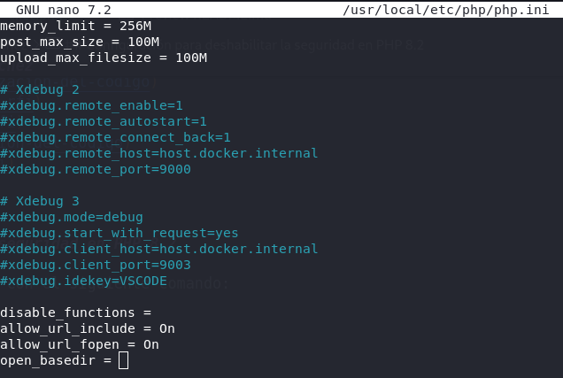
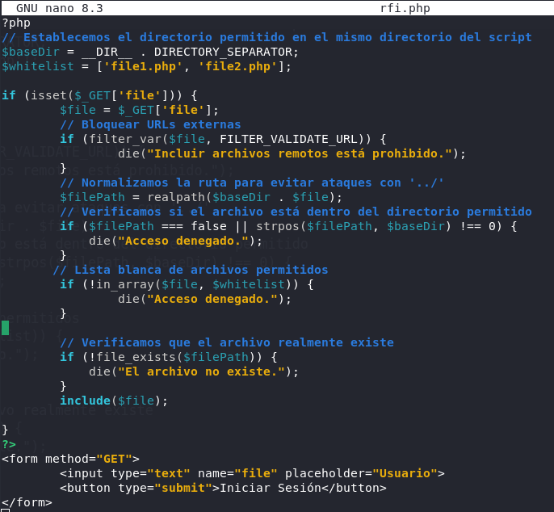

# PPS-Unidad3Actividad9-AdrianCurtoSanchez

- [Configuración para deshabilitar la seguridad en PHP 8.2](#configuración-para-deshabilitar-la-seguridad-en-php-82)
- [Código vulnerable ante RFI](#securizacion-del-código)
- [Explotación de RFI](#explotación-de-rfi)
- [Mitigación de RFI](#mitigación-de-rfi)
- [Securizacion del código](#securizacion-del-código)
- [Restaurar php.ini](#restaurar-phpini)


## Configuración para deshabilitar la seguridad en PHP 8.2

Accedemos al contendor de la pila lamp con el siguiente comando:
```
docker exec -it lamp-php83 /bin/bash
```


Creamos una copia de seguridad del archi `php.ini` para ello empleamos el comando:
```
cp /usr/local/etc/php/php.ini /usr/local/etc/php/php.backup
```


Editamos `php.ini` y añadimos las siguientes líneas de configuración al final del fichero:
```
disable_functions =
allow_url_include = On
allow_url_fopen = On
open_basedir = 
```



Salimos del contenedor y reiniciamos el contenedor de docker para que se apliquen los cambios ejecutando:
```
docker compose restart
```

## Código vulnerable ante RFI

Creamos un fichero `rfi.php` con el siguiente código cunerable:
```
<?php
// Verificar si se ha pasado un archivo por parámetro
if (isset($_GET['file'])) {
        $file = $_GET['file'];
        include($file);
}

?>
<form method="GET">
        <input type="text" name="file" placeholder="Usuario">
        <button type="submit">Subir Archivo</button>
</form>

```


## Explotación de RFI

El atacante crearía el siguiente fichero `exploit.php` malicioso.
```
<?php
echo "¡Servidor comprometido!";
// Código malicioso, como una web shell o un backdoor
?>
```

Dicho código malicioso estaría almacenado en un servidor del atacante.

El atacante colocaría la URL del fichero malicioso en la URL del dichero rfi.php:
```
http://localhost/rfi/rfi.php?file=http://localhost/rfi/exploit.php
```

Tras la subida el código malicioso se ejecuta en el servidor víctima.


## Mitigación de RFI

Para miticar el ataque RFI se deberá bloquear la inclusión de URLs externas como muestra la siguiente corrección del código vulnerable.

```
<?php
// Verificar si se ha pasado un archivo por parámetro
if (isset($_GET['file'])) {
        $file = $_GET['file'];
        // Bloquear URLs externas
        if (filter_var($file, FILTER_VALIDATE_URL)) {
                die("Incluir archivos remotos está prohibido.");
        }
        // Incluir el archivo sin más restricciones (Aún vulnerable a LFI)
        include($file);
}

?>
<form method="GET">
        <input type="text" name="file" placeholder="Usuario">
        <button type="submit">Iniciar Sesión</button>
</form>
```

Si intentamos de nuevo pasar por parámetro el fichero remoto del ataquete vemos que no está permitido.


Esta solución no es completa, puesto que permite a subida de archivos locales maliciosos.


La siguiente aproximación, sería limitar la inclusión de archivos solo a una lista de archivos específicos dentro del servidor:
```
<?php
// Verificar si se ha pasado un archivo por parámetro
if (isset($_GET['file'])) {
        $file = $_GET['file'];
        // Lista blanca de archivos permitidos
        $whitelist = ['file1.php', 'files/file2.php'];
        if (!in_array($file, $whitelist)) {
                die("Acceso denegado.");
        }
        // Incluir solo archivos de la lista blanca
        include($file);
}

?>
<form method="GET">
        <input type="text" name="file" placeholder="Usuario">
        <button type="submit">Iniciar Sesión</button>
</form>
```

Ahora sólo nos dejara incluir archivos definidos en la variable `$whitelist`.

## Prevenir la inclusión remota de archivos en PHP

Para prevenir la inclusión remota de archivos en PHP podemos configurar el servidor para que acepte únicamente archivos locales y no archivos remotos.

Esto, como hemos visto anteriormente se hace configurando la variable allow_url_include en el archivo php.ini. Esta opción previene ataques RFI globalmente.

```
allow_url_include = Off
```


## Securizacion del código

Impementamos el siguiente código securizado:
```
?php
// Establecemos el directorio permitido en el mismo directorio del script
$baseDir = __DIR__ . DIRECTORY_SEPARATOR;
$whitelist = ['file1.php', 'file2.php'];

if (isset($_GET['file'])) {
        $file = $_GET['file'];
        // Bloquear URLs externas
        if (filter_var($file, FILTER_VALIDATE_URL)) {
                die("Incluir archivos remotos está prohibido.");
        }
        // Normalizamos la ruta para evitar ataques con '../'
        $filePath = realpath($baseDir . $file);
        // Verificamos si el archivo está dentro del directorio permitido
        if ($filePath === false || strpos($filePath, $baseDir) !== 0) {
            die("Acceso denegado.");
        }
       // Lista blanca de archivos permitidos
        if (!in_array($file, $whitelist)) {
                die("Acceso denegado.");
        }
 
        // Verificamos que el archivo realmente existe
        if (!file_exists($filePath)) {
            die("El archivo no existe.");
        }
        include($file);

}
?>
<form method="GET">
        <input type="text" name="file" placeholder="Usuario">
        <button type="submit">Iniciar Sesión</button>
</form>

```


Con el código anterior logramos las siguientes medidas de seguridad:
- Bloqueadas URLs externas.
- Sanitización de ruta (eliminar ../ y evitar que el archivo no tenga caracteres maliciosos).
- Uso de lista blanca de archivos.

## Restaurar php.ini

Eliminamos el fichero actual `php.ini`(o lo renombramos) y renombramos la copia `php.backup` con los siguientes comandos

```
rm -f php.ini
mv php.backup php.ini
```

Tras realizar los cambios deberemos reniniciar el contenedor para que se apliquen.
